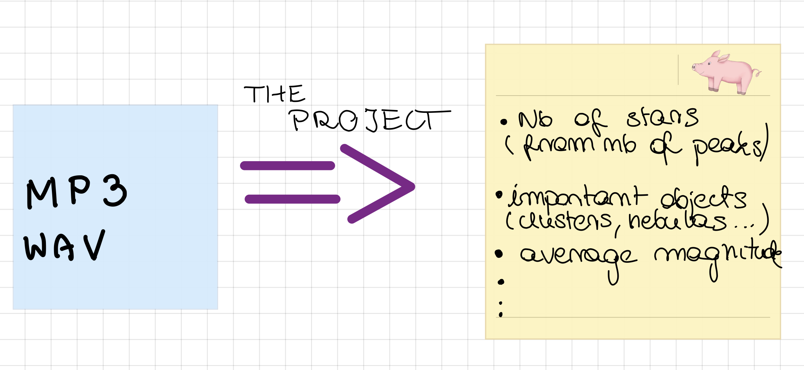

# Sonification
## What is sonification?
TO BE DONE -- can somebody add a small description here
The sonification is the action of turning astronomical images into sound. But people have already done that. What we are trying to do is the opposite. From a sound wave we want to extract the information on what actually was in the picture, e.g., the number of stars, specific astronomical objects, like clusters or nebulas, or the average magnitude.

## Our goal

Using phyton and our creativity :D we are going to write a program which will transform sound wave (sound file) into data about an astronomical picture. We are starting from writing a program, which will count the number of the stars by counting the peaks which appear in the waterfall graph extracted from the sound file.

## Current state of the project
All the example files are in [this folder](/Data).
An interesting project about turning visual data into soundwaves [here](https://astronify.readthedocs.io/en/latest/).
A paper about sonification [here](https://www.academia.edu/25317231/Sonification_of_Astronomical_Data).

# How to python?
Here I _tried_ to explain what you need to install in order to code in python and work on this project. Most of the softwares below are based on personal preference and ease of use but you can use any software you like.

## Installing Python 3
Python is a nice programming language used for a lot of stuff especially in science so it's a benefit to learn it. Below you can find the steps to install Python 3 on your computer:

1. Go to [the official website](https://www.python.org/downloads/) and download the latest version of python for your operating system. (As of the writing of this guide, the latest python version is 3.11 but anything above 3.6 should work)
1. Launch the installer and follow the instruction (please don't click next without reading at least what the page is about)
1. Done! Now you should have python working on your system.

## Installing Git
If you work on any project you may want to back up your changes, go back to a previous version that worked, or share your changes with your team. Sure, you can archive it many times (project_this_time_it_works_trust_me(3).zip) but it is kinda hard to keep track of everything, and let's be honest is very ugly. Well, this is exactly what git does (and also it can generate cool graphs about the state of the project). To install it follow the steps:

1. Go to the [git website](https://git-scm.com/downloads)
2. Select your operating system
3. Download and install the latest version available (For MacOS if you don't know how to use `brew`, under the section binary installer there is a hyperlink to a page where you can download a premade installer for your system)
4. Technically, git is installed and you can use it in the terminal, in the next steps we will install a software that does all the git commands for us

## Installing Visual Code
You can write code in any text editor you have, but is it convenient to have a special software that tells us where the mistakes are, what functions do, or can also run our code without opening the terminal. I prefer to use Visual Code because it can work with any programming language and looks cool.

1. Go to the [official website](https://code.visualstudio.com) and download Visual Code
2. Use the installer and follow the instructions
3. After Visual Code is installed open it and on the left side, you should see a list of icons. Click the one with 4 small squares (Extensions)
4. Search for python and install the first one (should be named exactly **Python**)
5. In the same search bar, search for **GitHub Pull Requests and Issues** and install this extension as well
6. Go on [GitHub](https://github.com) and make an account. This is like a cloud space for projects very useful when working with multiple people
7. Back to Visual Code. You should see a new icon on the left bar that looks like a cat (GitHub), click on it and log in with your new GitHub account.
8. On the left bar click on the icon with 3 circles connected with lines (Source Control). You should see 2 buttons, click the one named **Clone Repository** and put the link of the project on the new window that appeared. (To get the link of the project, press the Code button on top of this webpage and copy the https link)
9. Congratulations! Now you have access to the project! (If something goes wrong the GitHub integration steps are basically taken from [here](https://code.visualstudio.com/docs/sourcecontrol/github))

## How to manage packages/libraries/modules in python
As you can see in most of the code here we use external modules to simplify our lives. Most of them need to be installed manually. To do just that open a terminal (either in Visual Code (recommended) or PowerShell/Bash/CMD) and type:

`
pip install name_of_the_package
`

For example, NumPy is one of the most used packages. It handles operations with matrixes and vectors (and more). To install it just run `pip install numpy` in a terminal. See [this](https://packaging.python.org/en/latest/tutorials/installing-packages/) for more information.

## How to work on the project
It may be obvious that if multiple people work on one project it may happen that they need to edit the same files. To avoid any conflict that may arise ("Why did you delete that line, it was important for my idea?!") git has a feature called braches. 

As the name implies, you create your own branch in which you can modify anything you want without disrupting anybody and after you are done with your idea (and it works as intended) you can merge it with the main branch. To create your branch, in Visual Code in the bottom left corner there is a button (is not that obvious that it is a button but trust me) with the name of the branch you are currently working on (should say *main*). If you click on it you will see an option to create a new branch (I recommend naming them somehow related to your name). 

If you want to save your changes on github (in the cloud) click on the icon with 3 circles (Source control). Now you will see a list with all the changes that you made. On top of this list, right when it says *Changes*, if you hover your cursor there a plus button will appear (Stage All Changes), click on it. All it's left to do is to add a message about your changes and click **Commit** and **Sync Changes** (the message is mandatory for this to work). Again, I recommend committing your changes every time you add a new feature or when you want to close the project and take a break. Think about this as doing a backup in the cloud, a backup that can be accessed by every member of the project on any device.

